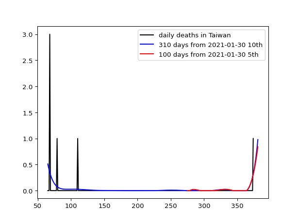

# taiwan

In order to run Python programs, see the following site for novice to install the necessary libraries: https://github.com/ytakefuji/python-novice

The new_deaths.csv is downloaded from the following site: 

https://raw.githubusercontent.com/owid/covid-19-data/master/public/data/jhu/new_deaths.csv

